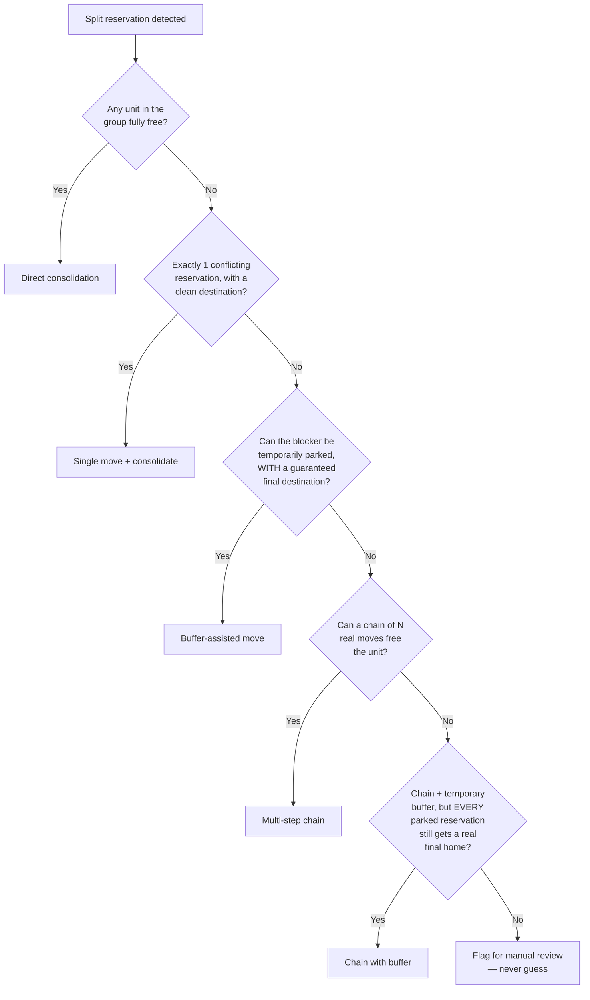

# Tetris — Automated Overbooking Resolution Engine

> A production system that automatically detects and resolves overbooking
> conflicts in a property management system, moving guest reservations
> between units in real time — without ever losing track of anyone.

**Note:** This repository is a technical case study, not the production
codebase. The real implementation talks to a specific PMS's private
admin panel and API, so it stays in a private repo. What's shown here is
the *architecture, algorithms, and engineering decisions* — genericized,
with no proprietary business logic, endpoints, or credentials.

---

## The problem

A property management system occasionally lets a booking split across
two or more physical units for the same stay — usually because inventory
was double-booked and the system auto-resolved it by fragmenting the
reservation instead of failing outright. The guest ends up scheduled to
change rooms mid-stay, which nobody wants and operations has to fix by
hand, unit by unit, room by room, often under time pressure.

At scale (1,000+ units across dozens of buildings), this happens dozens
of times a week. Fixing it by hand means: find every fragmented booking,
figure out which unit in the building has room for the *whole* stay,
check whether moving another guest out of the way is possible, and
execute the move — all before the guest notices anything's wrong.

## What I built

An unattended pipeline that:

1. **Detects** split reservations across the whole portfolio.
2. **Maps** the parent/child relationships between physical units (a
   legacy quirk of the PMS: a "unit" in the booking sense is sometimes
   a group of interchangeable physical rooms, and that mapping isn't
   exposed by any API — it only exists in the rendered admin calendar).
3. **Solves** the reshuffle: finds the minimum-disruption sequence of
   moves that consolidates the split booking into one real unit, trying
   increasingly complex strategies only as simpler ones fail.
4. **Executes** the plan against the live system, with safety checks
   before and after every write, and runs continuously, unattended.

## The solving strategy (in order of preference)



The hard rule threaded through every strategy: **a reservation can never
end a plan sitting in a temporary holding unit.** If the algorithm can't
prove a real final destination for everyone involved, it refuses to
propose the plan at all — a partial, "probably fine" answer is worse
than no answer, because there's no human in the loop watching it happen
in real time.

## Safety mechanisms

This is the part that mattered most in practice — the algorithm finding
a good plan is the easy 20%; making sure execution can't quietly leave
someone stranded is the hard 80%.

- **Live re-check before every write.** A plan can go stale between
  being calculated and being executed (new booking comes in through
  another channel in the meantime). Every move re-verifies the
  destination is *actually* free, with fresh data, immediately before
  writing.
- **Retry with recalculation, not blind retry.** If a destination turns
  out to be taken, retrying the identical move is pointless — it'll
  fail the same way every time. The retry logic instead searches for a
  *different* genuinely free unit and retries with that, only falling
  back to a fixed destination if no alternative exists.
- **Escalate loudly, never fail silently.** If a reservation is ever
  moved into a temporary buffer and the rest of the plan can't complete
  even after aggressive retries, the system raises a dedicated critical
  error, logs full detail (which reservation, which unit, what failed)
  to a persistent audit file, and moves on to the next item — it never
  blocks the whole pipeline waiting for a human, and it never pretends
  everything's fine.
- **Post-write verification.** The underlying API has been observed to
  report success on writes that were silently rejected. Every write is
  independently re-confirmed against the source of truth afterward.

## Real bugs found building this (the part I actually learned the most from)

- **Silent pagination gap.** An early version of the occupancy fetch
  only read the first page of results from a paginated endpoint. Units
  with more bookings than fit on one page looked artificially "free."
- **Stale cache across a batch.** Occupancy data was cached for
  performance within a single run. But once a write happened
  mid-batch, later reservations in the *same* run were still solved
  against pre-write data — the fix moved during the earlier item wasn't
  reflected yet. Fixed by invalidating the cache after every real write.
- **A UI framework switched to virtualized rendering.** A scraper that
  had worked reliably for months suddenly started returning a fraction
  of the expected rows. The admin calendar had switched its row
  rendering to only keep visible rows in the DOM (a common performance
  pattern for large lists) — the scraper needed to actively scroll and
  collect rows incrementally instead of reading the DOM once.
- **A search window narrower than the reservation it was solving for.**
  If a broken reservation's own stay extended past the configured
  search window's end date, the occupancy check for its own unit
  silently never looked that far — meaning it could "see" a unit as
  free for dates it had never actually queried.

None of these are exotic — they're the ordinary failure modes of
automating against someone else's UI and API. What mattered was
building the pipeline so that each of these failed *loudly and
safely* instead of silently producing a wrong answer.

## Architecture

```
src/<package>/
├── config.py       # constants, environment/credentials boundary
├── detection.py     # finds split reservations
├── occupancy.py     # per-unit occupancy, with caching
├── grouping.py       # parent/child unit mapping (browser automation)
├── solver.py         # the decision engine — pure logic, no I/O
├── execution.py       # writes to the live system, with all the safety nets
├── errors.py          # custom errors + persistent audit logging
└── pipeline.py         # orchestration: one cycle, and the unattended loop
```

`solver.py` has zero network dependencies — every decision-making
function takes plain data in and returns plain data out. That's what
makes it possible to unit-test the entire decision tree (circular
dependency chains, buffer-safety guarantees, edge cases around
protected reservation types) in well under a second, with no mocking of
HTTP at all.

## Stack

Python · BeautifulSoup (scraping a server-rendered admin panel with no
public API for some data) · Playwright (browser automation for a
JS-virtualized calendar view) · pytest

## What's not here

The private repo additionally contains the real API integration
(`occupancy.py`, `execution.py`'s live endpoints), the real
business-specific configuration (unit codes, protected partner rules),
and the credentials boundary. None of that is portable or interesting
outside the specific system it talks to — the part worth sharing is the
solving algorithm and the operational safety design, both above.
