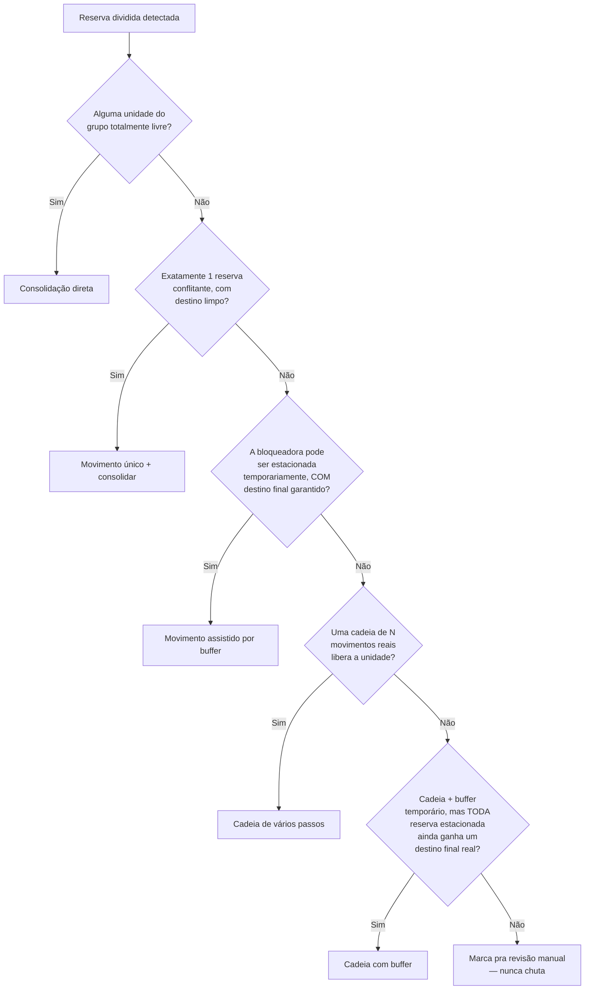

# Tetris — Motor de Resolução Automática de Overbooking

> Um sistema em produção que detecta e resolve automaticamente conflitos
> de overbooking num sistema de gestão de propriedades (PMS), movendo
> reservas de hóspedes entre unidades em tempo real — sem nunca perder o
> rastro de ninguém.

**Nota:** este repositório é um estudo de caso técnico, não o código de
produção. A implementação real fala com o painel administrativo e a API
privados de um PMS específico, então fica num repositório privado. O que
está aqui é a **arquitetura, os algoritmos e as decisões de engenharia**
— genericizados, sem lógica de negócio, endpoints ou credenciais
proprietárias.

---

## O problema

Um sistema de gestão de propriedades às vezes permite que uma reserva
fique dividida entre duas ou mais unidades físicas pra a mesma estadia —
geralmente porque houve overbooking e o sistema resolveu sozinho
fragmentando a reserva em vez de simplesmente falhar. O hóspede acaba
programado pra trocar de quarto no meio da estadia, o que ninguém quer, e
a operação precisa corrigir na mão, unidade por unidade, quarto por
quarto, muitas vezes sob pressão de tempo.

Em escala (1.000+ unidades espalhadas por dezenas de prédios), isso
acontece dezenas de vezes por semana. Corrigir na mão significa: achar
toda reserva fragmentada, descobrir qual unidade do prédio tem espaço
pra estadia **inteira**, checar se dá pra mover outro hóspede do caminho,
e executar o movimento — tudo antes que o hóspede perceba que algo está
errado.

## O que eu construí

Um pipeline sem supervisão que:

1. **Detecta** reservas divididas em todo o portfólio.
2. **Mapeia** as relações pai/filho entre unidades físicas (uma
   particularidade do PMS legado: uma "unidade" no sentido de reserva às
   vezes é um grupo de quartos fisicamente intercambiáveis, e esse
   mapeamento não é exposto por nenhuma API — só existe no calendário
   administrativo renderizado).
3. **Resolve** o remanejamento: encontra a sequência de movimentos com
   menor disrupção que consolida a reserva dividida numa unidade real,
   tentando estratégias cada vez mais complexas só quando as mais
   simples falham.
4. **Executa** o plano contra o sistema em produção, com verificações de
   segurança antes e depois de cada escrita, rodando continuamente, sem
   supervisão.

## A estratégia de resolução (em ordem de preferência)



A regra rígida que atravessa toda estratégia: **uma reserva nunca pode
terminar um plano parada numa unidade de estacionamento temporário.** Se
o algoritmo não conseguir provar um destino final real pra todo mundo
envolvido, ele se recusa a propor o plano — uma resposta parcial,
"provavelmente ok", é pior que nenhuma resposta, porque não tem nenhum
humano acompanhando em tempo real enquanto isso acontece.

## Mecanismos de segurança

Essa foi a parte que mais importou na prática — o algoritmo achar um bom
plano é os 20% fáceis; garantir que a execução não consiga deixar
ninguém esquecido silenciosamente é os 80% difíceis.

- **Reverificação ao vivo antes de cada escrita.** Um plano pode ficar
  desatualizado entre ser calculado e ser executado (uma reserva nova
  chega por outro canal nesse meio-tempo). Todo movimento reconfirma que
  o destino está **de verdade** livre, com dados frescos, bem antes de
  escrever.
- **Retry com recálculo, não retry cego.** Se um destino já foi ocupado,
  tentar de novo o mesmo movimento é inútil — vai falhar do mesmo jeito
  sempre. A lógica de retry busca uma unidade **diferente**,
  genuinamente livre, e tenta com ela, só caindo pro destino fixo se não
  houver alternativa nenhuma.
- **Escalar em voz alta, nunca falhar em silêncio.** Se uma reserva for
  movida pra um buffer temporário e o resto do plano não conseguir
  completar mesmo depois de tentativas agressivas, o sistema levanta um
  erro crítico dedicado, registra todo o detalhe (qual reserva, qual
  unidade, o que falhou) num arquivo de auditoria persistente, e segue
  pro próximo item — nunca trava o pipeline inteiro esperando um
  humano, e nunca finge que está tudo bem.
- **Verificação pós-escrita.** Já observamos a API subjacente reportar
  sucesso em escritas que foram recusadas silenciosamente. Toda escrita
  é reconfirmada, de forma independente, contra a fonte da verdade
  depois.

## Bugs reais encontrados construindo isso (a parte que eu mais aprendi)

- **Buraco silencioso de paginação.** Uma versão inicial da busca de
  ocupação só lia a primeira página de resultados de um endpoint
  paginado. Unidades com mais reservas do que cabia numa página pareciam
  "livres" artificialmente.
- **Cache desatualizado dentro do mesmo lote.** Os dados de ocupação
  ficavam em cache por performance dentro de uma única execução. Mas
  assim que uma escrita acontecia no meio do lote, reservas seguintes
  **da mesma execução** continuavam sendo resolvidas com dados de antes
  da escrita — a mudança feita no item anterior ainda não estava
  refletida. Corrigido invalidando o cache depois de toda escrita real.
- **Um framework de UI mudou pra renderização virtualizada.** Um scraper
  que funcionava de forma confiável havia meses de repente começou a
  retornar uma fração das linhas esperadas. O calendário administrativo
  tinha mudado a renderização de linhas pra manter no DOM só as
  visíveis (um padrão comum de performance pra listas grandes) — o
  scraper precisou passar a rolar ativamente e coletar linhas aos
  poucos, em vez de ler o DOM de uma vez só.
- **Janela de busca mais curta que a própria reserva sendo resolvida.**
  Se a estadia de uma reserva quebrada ultrapassava a data final
  configurada da busca, a checagem de ocupação da própria unidade dela
  simplesmente nunca olhava até lá — ou seja, podia "enxergar" uma
  unidade como livre pra datas que nunca tinha sequer consultado.

Nenhum desses é exótico — são os modos de falha comuns de automatizar
contra a UI e a API de outra pessoa. O que importou foi construir o
pipeline pra que cada um desses falhasse **alto e com segurança**, em
vez de silenciosamente produzir uma resposta errada.

## Arquitetura

```
src/<pacote>/
├── config.py       # constantes, fronteira de ambiente/credenciais
├── deteccao.py       # encontra reservas divididas
├── ocupacao.py        # ocupação por unidade, com cache
├── agrupamento.py       # mapeamento de unidades pai/filho (navegador)
├── solver.py             # o motor de decisão — lógica pura, sem I/O
├── execucao.py             # escreve no sistema em produção, com toda a proteção
├── erros.py                 # erros customizados + registro de auditoria persistente
└── pipeline.py                # orquestração: um ciclo, e o loop sem supervisão
```

`solver.py` não tem nenhuma dependência de rede — toda função de decisão
recebe dados simples e devolve dados simples. É isso que torna possível
testar a árvore de decisão inteira (cadeias circulares, garantias de
segurança do buffer, casos de borda de reservas protegidas) em bem menos
de um segundo, sem nenhum mock de HTTP.

## Stack

Python · BeautifulSoup (raspando um painel administrativo renderizado no
servidor, sem API pública pra alguns dados) · Playwright (automação de
navegador pra um calendário virtualizado em JS) · pytest

## O que não está aqui

O repositório privado contém, além disso, a integração real com a API
(os endpoints de verdade de `ocupacao.py` e `execucao.py`), a
configuração real específica do negócio (códigos de unidade, regras de
parceiro protegido), e a fronteira de credenciais. Nada disso é portável
ou interessante fora do sistema específico com quem conversa — a parte
que vale compartilhar é o algoritmo de resolução e o design de
segurança operacional, ambos acima.
